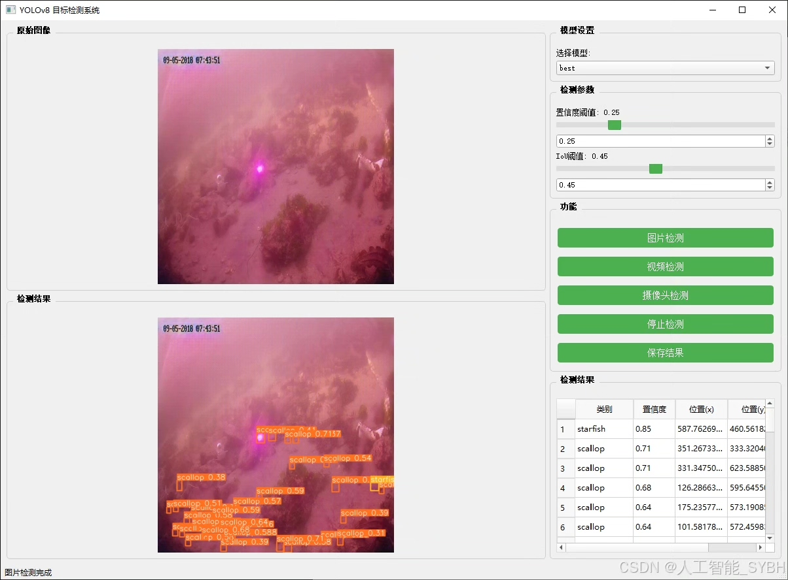
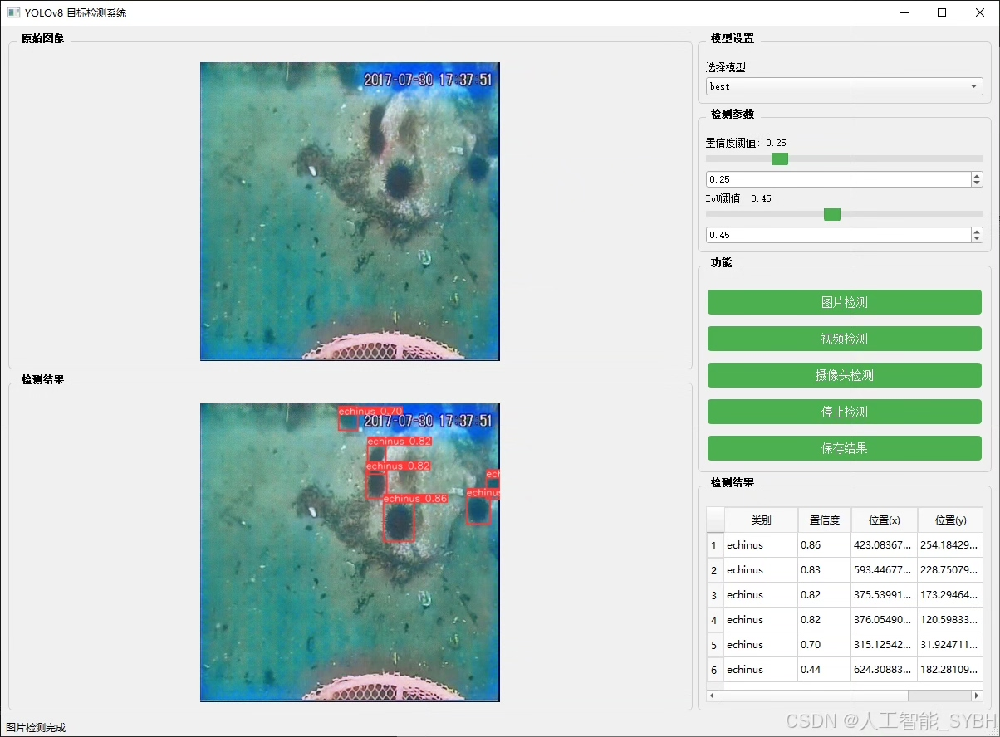
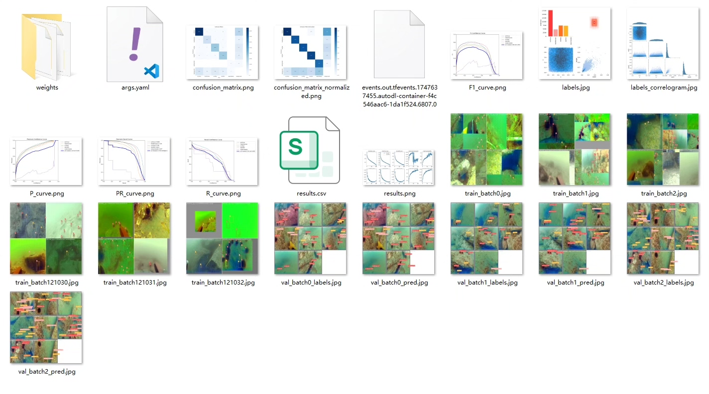
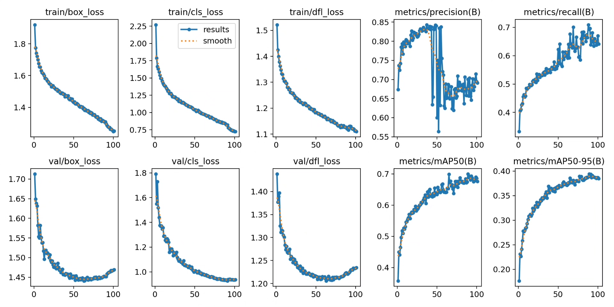
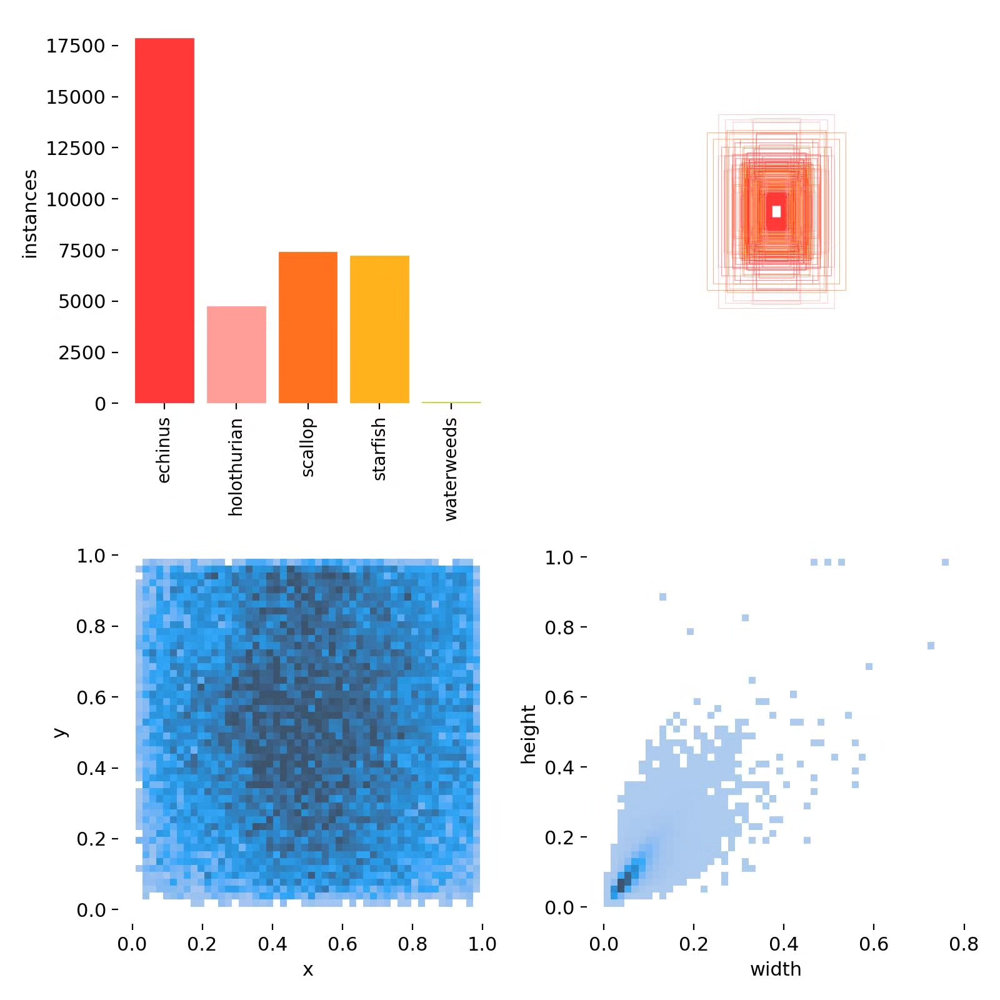
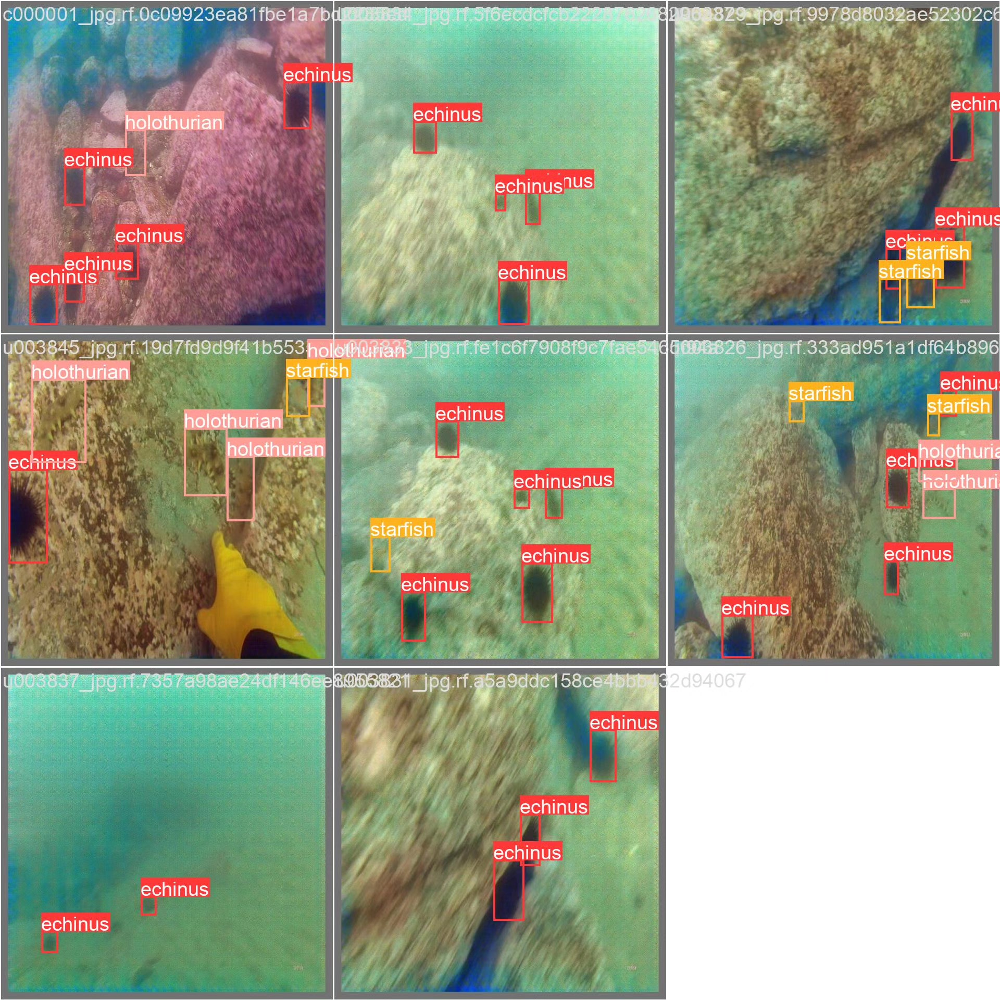
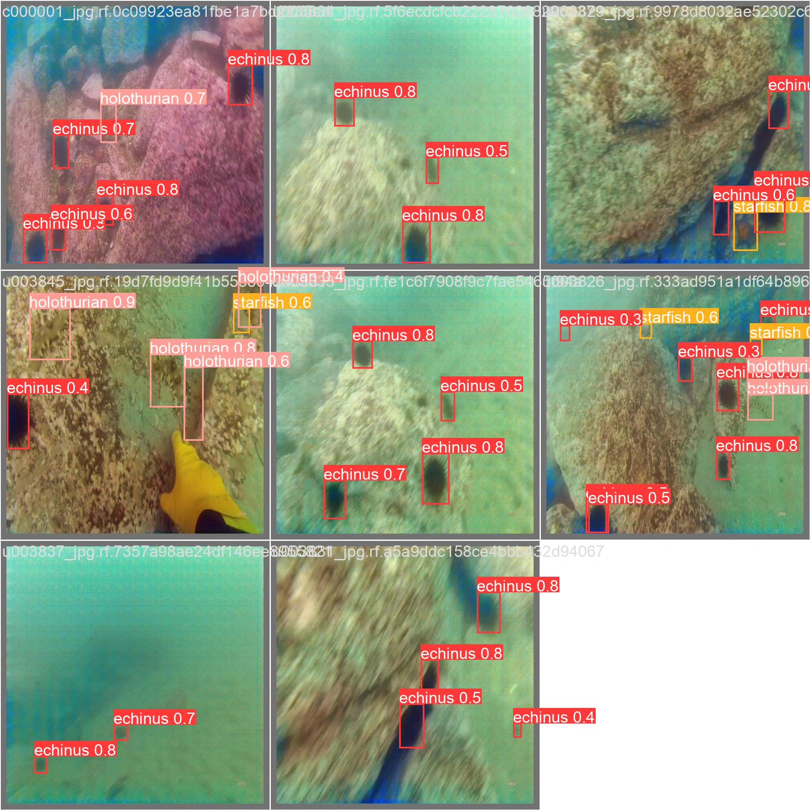

# Underwater biometric identification detection system based on deep learning YOLOv8

## Body

Based on the cutting-edge YOLOv8 deep learning framework, this project has developed a specialized underwater biometric detection system for marine ecological environments. It can accurately identify and classify five typical underwater organisms and plants: sea urchin (echinus), holothurian (holothurian), scallop (scallop), starfish (starfish), and waterweeds (waterweeds). The system was trained and optimized on a professional underwater dataset containing 5,320 training images, 1,520 validation images, and 760 test images. It overcomes technical challenges such as light scattering, color distortion, and low contrast in underwater images, achieving high accuracy target detection in complex underwater environments.

The company's products have been granted commercial license certification by YOLO.

We provide after-sales service.

After payment, we will provide a WeChat account to answer questions at any time.

Environmental configuration: We will provide a tutorial on how to configure the environment, and WeChat will provide answers.

Remote installation service: If you need remote configuration, an additional fee of 69 is required.
If the configuration fails, all fees will be refunded (only the installation fee is refundable for older computers).

Retraining dataset: After configuring the environment, you can train on your own computer.
If you need us to retrain, just pay 69 plus computing power fees (2.5 yuan/hour).

Full after-sales service

## Images

## Payment

Here is a pay link on Stripe ( https://buy.stripe.com/3cs8yP7sY87d0vu9AB ). Please contact me lonlonago@foxmail.com after funding $89, and I will send you a complete data files , thank you!

